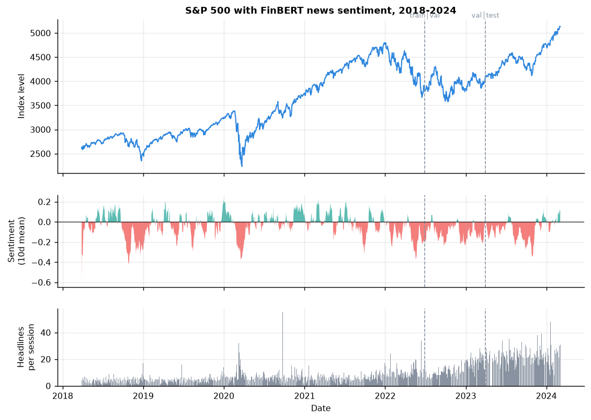
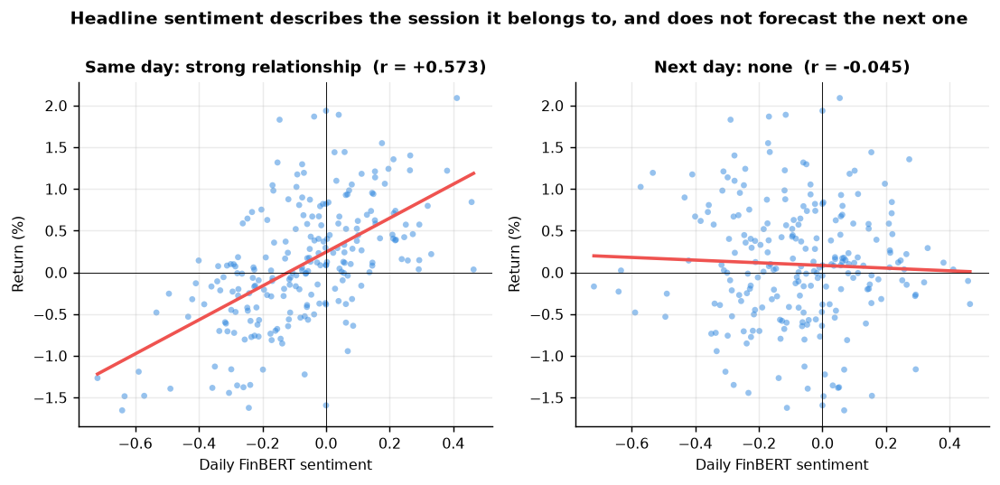
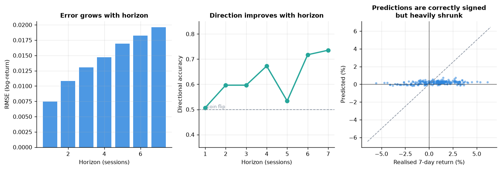
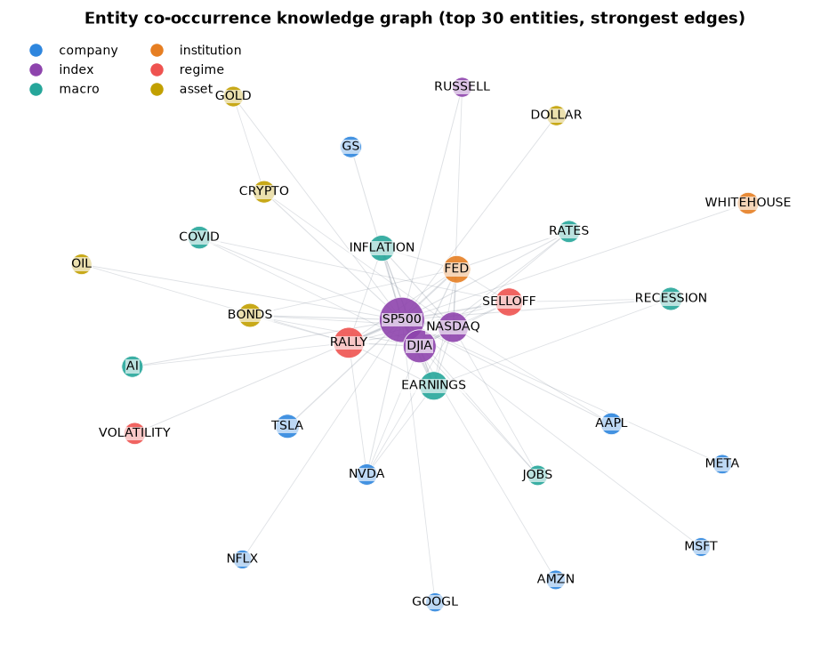
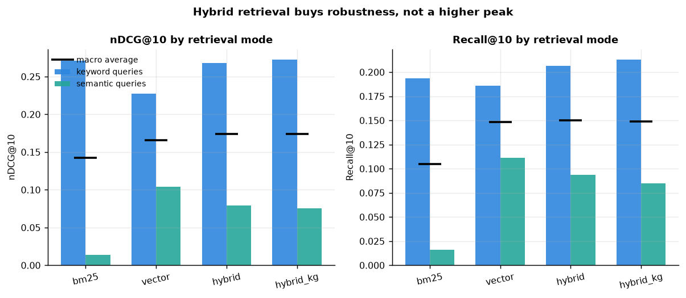
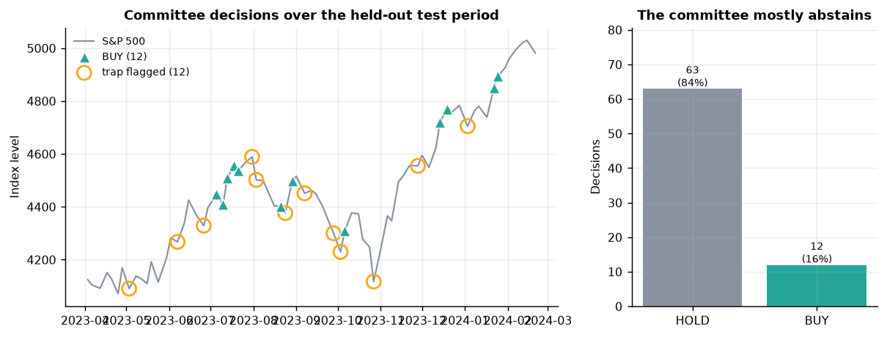

# FinAgent-Pulse — Technical Report

**Multi-Agent Quantitative Trading & Sentiment Analysis using Hybrid RAG and Time-Series Forecasting**

DA592 Term Project · Müge Evran (38033), Gökçe Güleviz (38096), Umut Gümüş (38239)

---

## 1. Scope and data

The system studies the **S&P 500 between 2018 and 2024**, fusing a numerical
price channel with a semantic news channel and routing both through an
autonomous three-agent investment committee.

| Source | Content | Rows | Coverage |
|---|---|---|---|
| Kaggle `s-and-p-500-with-financial-news-headlines-20082024` | headlines + daily close | 19,127 → **12,456** after filtering | 2018-01-02 → **2024-03-04** |
| yfinance `^GSPC` | daily OHLCV | 1,760 sessions | 2018-01-01 → 2024-12-31 |
| Curated markdown knowledge base | investment principles (Graham, risk management, behavioural finance) | 15 chunks | — |

**The corpus ends on 2024-03-04.** "2018–2024" therefore means 2018-01-02 to
2024-03-04 throughout this report; 2024 contributes 43 trading days, not a full
year. Market data is pulled beyond the corpus end so that forward 7-day targets
exist for every decision date.

Cleaning removed 966 headlines (7.2%): syndicated same-day duplicates and
fragments shorter than 15 characters. Merging price, technical and sentiment
features and dropping rows lost to 60-day rolling windows yields **1,493
trading sessions from 2018-03-28 to 2024-03-04**, of which 98.5% carry at least
one headline.

News published on a weekend or holiday is attributed to the **next** trading
session — the first moment it could have moved a price.



---

## 2. Architecture

```
Kaggle headlines ──► clean / dedupe ──► FinBERT ──► daily sentiment vector ─┐
                            │                                              ├─► feature table ──► Bi-LSTM ──► 7-day trajectory
yfinance OHLCV ─────────────┴──────────► technical indicators ─────────────┘                          │
                            │                                                                          │
                            └──► ChromaDB (dense) + BM25 (sparse) + knowledge graph ──► Hybrid RAG ─────┤
                                                                                                        ▼
   investment-principles KB ──────────────────────────────────────────────────► LangGraph committee ──► directive + report
                                                     Data Analyst → Sentiment Critic → Risk Manager
```

### 2.1 A deliberate architectural choice: decisions are not generated by an LLM

Each agent computes its **findings and the final Buy/Sell/Hold directive
deterministically in Python**. The language model is used only to write the
prose explaining them.

This matters for a financial system. If an LLM emitted the directive directly,
the same market state could produce different calls on different runs, the
decision logic could not be unit-tested, and a hallucinated number could flow
straight into a recommendation. With the split, every directive is reproducible
and auditable, and the model does what it is genuinely good at.

A consequence worth stating plainly: **the system runs fully without any LLM API
key**, falling back to a template renderer that produces the same report
structure. Setting `ANTHROPIC_API_KEY` upgrades the prose, never the decision.

---

## 3. Sentiment engine (FinBERT)

`ProsusAI/finbert` scores all 12,456 headlines. The three-way softmax is reduced
to a signed intensity `sentiment = P(positive) − P(negative) ∈ [−1, 1]`.

Label distribution: **50.0% neutral, 28.7% negative, 21.3% positive**; mean
sentiment −0.069, i.e. financial headlines skew mildly negative, as expected.

Per-session aggregation produces mean, dispersion, positive/negative share and
coverage count, plus 5-day smoothing and a momentum term.

### 3.1 Validation — and an important negative result

There are no human sentiment labels for this corpus, so the engine is validated
the way it is actually used: **against the market**, on the held-out test period
only (223 sessions, 2023-04 → 2024-02).

| Check | Result | Interpretation |
|---|---|---|
| Correlation with **same-day** return | **r = +0.573** (block-bootstrap p = 0.0002) | very strong |
| Correlation with **next-day** return | r = −0.045 (block-bootstrap p = 0.49) | **none** |
| Next-day directional hit rate | 50.8% | a coin flip |
| Bullish vs bearish quintile, next-day return | +16.8 bp vs +21.2 bp (p = 0.75) | no separation |

Both p-values come from a circular block bootstrap (5 000 draws, 10-session
blocks), not from `pearsonr`. Sentiment and returns are each autocorrelated, so
the i.i.d. assumption behind the textbook p-value does not hold: it reports
1.8 × 10⁻²¹ for the same-day correlation where a dependence-aware test gives
2 × 10⁻⁴. The conclusion is unchanged — the same-day relationship is real and
the next-day one is absent — but only the bootstrap figure is defensible, and it
is 17 orders of magnitude less emphatic.



**FinBERT reads the market it is describing, not the one that follows.** The
same-day correlation of 0.573 confirms the engine is genuinely measuring
financial sentiment rather than noise — a broken scorer could not achieve it.
But published headlines are *reactions*: by the time a headline exists, the
information is in the price.

This finding shaped the rest of the design. Sentiment is treated as
**confirmation and contradiction evidence**, never as a standalone forecast —
which is exactly the role the Risk Manager assigns it in §6.

---

## 4. Bi-LSTM forecaster

**Target.** Cumulative log-returns `log(P_{t+h}/P_t)` for h = 1…7, *not* price
levels. Regressing on levels yields a near-perfect R² that only reflects
tomorrow's price being close to today's.

**Architecture.** 60-day lookback → 2-layer bidirectional LSTM (hidden 64,
dropout 0.25) → the concatenated ends of the bidirectional encoding →
LayerNorm → GELU MLP → 7 outputs. Bidirectionality is safe here: the window
lies entirely in the past relative to the forecast origin.

**Training.** Huber loss on per-horizon standardised targets (so the 1-day and
7-day heads contribute comparably), AdamW, gradient clipping, early stopping on
validation loss. Three seeds (42/1337/2024) are averaged — a single LSTM on
~1,000 noisy windows has high initialisation variance.

**Leakage control.**

- Chronological splits: train ≤ 2022-06-30, validation ≤ 2023-03-31, test after.
- An **embargo** purges any window whose 7-day target crosses a split boundary.
- The feature scaler and the target scaler are fitted on training rows only.
- Effective spans: train 2018-06-21→2022-06-16 (1,005 windows), validation
  2022-07-01→2023-03-17 (179), **test 2023-04-03→2024-02-21 (223)**.

### 4.1 Results (held-out test period)

| Metric | Value |
|---|---|
| RMSE (log-return, all horizons) | **0.01495** |
| R² (return space) | **−0.0204** |
| R² (price space) | 0.9340 |
| MAPE (reconstructed price) | 1.14% |
| Directional accuracy @ h=7 | **73.5%** |
| Skill vs. zero-return baseline | **+2.97%** |

| h | RMSE | R² (return) | Directional accuracy |
|---|---|---|---|
| 1 | 0.00744 | −0.016 | 50.7% |
| 2 | 0.01084 | −0.008 | 59.6% |
| 3 | 0.01305 | −0.003 | 59.6% |
| 4 | 0.01471 | +0.008 | 67.3% |
| 5 | 0.01695 | −0.065 | 53.4% |
| 6 | 0.01826 | −0.027 | 71.7% |
| 7 | 0.01958 | −0.012 | **73.5%** |



### 4.2 How to read these numbers honestly

**The price-space R² of 0.934 is not an achievement.** It is what any model
scores when the target is a price level. The return-space R² of −0.0204 is the
honest measure, and it says the model explains no more variance than predicting
zero. That is the normal, expected result for short-horizon index forecasting —
if a small LSTM on public headlines could do materially better, the result would
be evidence of a bug rather than of skill.

What *is* meaningful is that **magnitude and direction come apart**. The model
cannot size the move but does call its sign: 73.5% at the 7-day horizon against
a 50% baseline, rising monotonically with horizon (short horizons are dominated
by microstructure noise; weekly drift is more predictable). The scatter in
figure 2 shows why: predictions are correctly signed but heavily shrunk toward
zero — a well-regularised model refusing to overstate its confidence.

Directional accuracy is the metric the decision layer actually consumes.

### 4.3 Ablation — does the sentiment channel earn its place?

| Variant | Features | RMSE | R² (return) | Direction @ h=7 | Skill vs naive |
|---|---|---|---|---|---|
| Price only | 8 | **0.01483** | −0.004 | 67.7% | **+3.77%** |
| Sentiment only | 7 | 0.01576 | −0.134 | 58.7% | −2.30% |
| Price + sentiment | 15 | 0.01495 | −0.020 | **73.5%** | +2.97% |

**Sentiment improves direction and slightly worsens magnitude.** Adding the
seven sentiment features lifts directional accuracy by 5.8 points (67.7% →
73.5%) while RMSE degrades by 0.8%. Sentiment alone is clearly worse than
price alone, so it is not a substitute for the price channel — but it carries
directional information the price channel does not.

Given that the decision layer consumes direction and ignores magnitude, the
combined model is the right choice, and the trade-off is explicit rather than
hidden.

---

## 5. Hybrid RAG

Three retrieval structures over the same 12,456 headlines:

1. **Dense** — ChromaDB with `all-MiniLM-L6-v2` embeddings, cosine space.
2. **Sparse** — BM25-Okapi.
3. **Knowledge graph** — 56 entities, 534 weighted co-occurrence edges, built
   from a curated finance alias lexicon. On short, ticker-heavy headlines a
   curated lexicon beats general-purpose NER and, crucially, every edge is
   traceable to the surface form that produced it.



### 5.1 Two design problems found and fixed

**Hub entities poisoned query expansion.** Ranking graph neighbours by raw
co-occurrence returned `SP500`, `DJIA`, `NASDAQ` for every query — every
headline in this corpus is about the S&P 500, so those entities carry zero
discriminative information. Fix: rank by Salton association
`w(a,b)/√(mentions(a)·mentions(b))` **and** drop entities appearing in more than
15% of the corpus, treating them as stopwords. "Banking crisis contagion" then
expands to `SVB, CS, HOUSING, JPM` instead of `SP500, DJIA`.

**Query mutation corrupted both retrievers.** Appending expansion terms to the
query text diluted the embedding and derailed BM25 — the first `hybrid_kg`
implementation scored *below* plain `hybrid` on every metric. Fix: run the
expanded query as **additional, down-weighted retrieval arms** alongside the
original, preserving user intent while adding recall.

**Fusion.** Weighted Reciprocal Rank Fusion (k = 60) over the arms. RRF fuses
ranks rather than scores because cosine similarity and BM25 are on incomparable
scales. Arm weights were grid-searched on a **development split (seed 7)
disjoint from the reported benchmark (seed 42)**: dense 1.0, sparse 0.80,
expanded arms 0.25.

The 35-point grid spans nDCG@10 **0.1389–0.1756**, and the two axes are not
alike. The sparse weight matters: at `bm25_weight = 0` the grid mean is 0.1472
against 0.1727 across 0.45–0.80, so BM25 carries real signal and this weight is
worth calibrating. The expansion weight does not: the best configuration with the
KG arms switched off entirely scores 0.1736 against 0.1756 with them on
(**+1.1%**), and the grid mean falls monotonically once the weight exceeds 0.25
(0.1698 → 0.1667 → 0.1643 → 0.1619). So 0.25 is the argmax of a genuinely shallow
optimum, and the accurate summary is that the fusion is sensitive to the sparse
weight and insensitive to the expansion weight.

### 5.2 Ablation protocol

With no editorial relevance judgements available, the benchmark uses a
**degraded known-item** protocol (standard IR practice in this situation):

- 136 seed headlines mentioning ≥ 2 entities.
- A document is **relevant** if it shares ≥ 2 entities with the seed and falls
  within ±15 days — the same market event cluster. Median cluster size: 14.
- Two deliberately lossy query styles, so exact string matching is impossible:
  - **keyword** — a shuffled 50% subset of the seed's content words.
  - **semantic** — a natural-language question built from the seed's entities
    only, sharing almost no surface tokens with the target.

Reporting both styles is the point of the study.

### 5.3 Results (top-k = 10)

| Query style | Mode | Recall@10 | Precision@5 | MRR | nDCG@10 |
|---|---|---|---|---|---|
| keyword | vector | 0.1861 | 0.1794 | 0.5743 | 0.2271 |
| keyword | bm25 | 0.1934 | 0.1971 | **0.7664** | 0.2711 |
| keyword | hybrid | 0.2062 | **0.2221** | 0.6982 | 0.2682 |
| keyword | **hybrid_kg** | **0.2129** | 0.2176 | 0.7093 | **0.2725** |
| semantic | **vector** | **0.1110** | **0.0853** | **0.1950** | **0.1040** |
| semantic | bm25 | 0.0158 | 0.0103 | 0.0306 | 0.0136 |
| semantic | hybrid | 0.0936 | 0.0544 | 0.1434 | 0.0792 |
| semantic | hybrid_kg | 0.0850 | 0.0559 | 0.1441 | 0.0752 |
| **macro avg** | bm25 | 0.1046 | 0.1037 | 0.3985 | 0.1424 |
| **macro avg** | vector | 0.1485 | 0.1324 | 0.3847 | 0.1655 |
| **macro avg** | hybrid | **0.1499** | **0.1382** | 0.4208 | 0.1737 |
| **macro avg** | **hybrid_kg** | 0.1490 | 0.1368 | **0.4267** | **0.1738** |



### 5.4 What the ablation actually shows

**Hybrid retrieval buys robustness, not a higher peak.**

Each single retriever wins on the query style that suits it and collapses on
the other. BM25 posts the best MRR in the whole study on keyword queries
(0.766) and then falls to **0.0136 nDCG on semantic queries — a 20× collapse**,
because a natural-language question shares no rare terms with any headline.
The dense index is the mirror image: best on semantic, mediocre on keyword.

The fused modes never collapse. On macro average `hybrid_kg` posts the top nDCG
(0.1739) and MRR (0.4267) and `hybrid` the top recall (0.1499), both ahead of
either component alone.

### 5.4.1 Which of these differences are real

Every mode is scored on the same queries, so the comparisons are paired and the
per-query differences carry the evidence. `rag/evaluate.py::significance_table`
runs a 10 000-draw paired bootstrap over them; the output is
`reports/rag_significance.csv`.

| Comparison | Query style | Δ nDCG@10 | 95% CI | p |
|---|---|---|---|---|
| hybrid − vector | keyword | **+0.0403** | [+0.024, +0.057] | **<0.001** |
| hybrid − vector | semantic | **−0.0248** | [−0.039, −0.011] | **<0.001** |
| hybrid − vector | pooled | +0.0077 | [−0.003, +0.019] | 0.175 |
| hybrid_kg − vector | pooled | +0.0084 | [−0.005, +0.021] | 0.204 |
| hybrid_kg − hybrid | pooled | +0.0006 | [−0.005, +0.006] | 0.825 |
| hybrid − bm25 | pooled | **+0.0309** | [+0.012, +0.050] | **0.002** |

Three things follow, and the first is uncomfortable:

**The margin over dense-only is not statistically significant.** The headline
+5.0% (now +5.1%) macro-average gain over `vector` carries p = 0.20 and a
confidence interval straddling zero. On this benchmark, at this sample size, we
cannot claim the fused system retrieves better than the dense index alone.

**The per-style trade-off, on the other hand, is strongly significant in both
directions.** Fusion beats dense retrieval on keyword queries (+0.040,
p < 0.001) and loses to it on semantic queries (−0.025, p < 0.001). Both effects
are real; they very nearly cancel, and that cancellation is what produces the
non-significant pooled figure. Reporting only the pooled number hides two
genuine findings inside one null one.

**The robustness claim survives, restated.** What the fusion demonstrably buys
is not an edge over dense retrieval but an edge over sparse retrieval: `hybrid`
beats `bm25` by +0.031 pooled (p = 0.002), because it never enters BM25's
semantic-query collapse. That is a real, measured, significant property — and
it is a different sentence from "hybrid RAG beats standard RAG".

The honest reading is that the fused system's value is *variance reduction*: it
guarantees never landing in BM25's semantic-query failure mode, at the cost of
giving up BM25's keyword-query peak. For a system whose queries are written by
an agent in unpredictable phrasing, that trade is worth making.

**Knowledge-graph expansion is the component this study does not manage to
justify.** Against `hybrid` it buys **+1.6% nDCG on keyword queries** and costs
**−5.1% on semantic ones**; the two very nearly cancel, which is exactly why the
macro average moves by +0.06%. The weight calibration reaches the same conclusion
independently (§5.1): switching the expanded arms off costs 1.1% on the
development split, and every weight above 0.25 makes matters worse. The arm is
retained because keyword-style queries are the ones it helps, but on this
benchmark its contribution is not distinguishable from noise and it is not
reported as a win. The paired bootstrap settles it: pooled p = 0.825, and even
the keyword-side gain it was retained for reaches only p = 0.24. There is no
measurement in this study that justifies the knowledge-graph arm.

---

## 6. The agent committee

Three LangGraph nodes run in sequence; state flows forward so the Risk Manager
sees both upstream analyses.

**1 · Data Analyst.** Runs the Bi-LSTM, computes the return z-score, the
volatility percentile and regime, RSI, distance from the 50-day average, and
the **signal-to-noise ratio** = |7-day forecast| ÷ (20-day volatility × √7).
Flags structural anomalies.

**2 · Sentiment Critic.** Retrieves the trailing 14 days via `hybrid_kg`,
aggregates FinBERT sentiment, computes the **Fear & Greed index** (20-day
smoothed sentiment, percentile-ranked point-in-time against the sessions
preceding the decision date, so 50 is a typical day so far), identifies driver
entities, and raises a contrarian flag when coverage exceeds 70% one-sided.
The index is reported to the committee and the dashboard but does **not** enter
the directive rule — the Risk Manager gates on raw sentiment, not on this scale.

**3 · Risk Manager.** Retrieves applicable principles from the knowledge base
and issues the directive under two gates.

A note on the scale of that knowledge base, since the phrase invites a larger
picture: it is **three markdown files we wrote ourselves, 87 lines and 15
chunks in total**, and the agent retrieves 3 of the 15 per decision. It is a
citation layer that makes each directive traceable to a stated principle, not a
corpus, and it does not enter the decision rule — the gates below are computed
from model output alone.

The two gates:

- **Conviction gate** — signal-to-noise ≥ 0.175.
- **Confirmation gate** — the quantitative and sentiment channels must not
  contradict each other.

Direction then follows the forecast sign. Position size scales with conviction
and is **halved** in a top-quintile volatility regime.

### 6.1 Why the conviction gate is a percentile, not an absolute threshold

The first implementation required the forecast to exceed its own horizon
volatility (signal-to-noise ≥ 1.0). Measured on validation, **signal-to-noise
spans 0.005–0.499 and never approaches 1.0** — a 7-day index forecast is
structurally small relative to 7-day noise. That gate produced **HOLD on 45 of
45 test decisions**: technically safe, practically useless.

An early version also gated on absolute forecast return *and* on
signal-to-noise. Since signal-to-noise already encodes magnitude, this tested
the same quantity twice and allowed exactly 1 trade in 45. The absolute gate
was removed and now serves only as a 0.1% numerical-triviality floor.

The surviving gate is set at the **80th percentile of the validation
signal-to-noise distribution (0.175)** by
`evaluation.calibrate_decision_thresholds()`. The committee therefore acts on
its most confident quintile of days and abstains otherwise — a relative
conviction rule, calibrated on validation and reported on test.

### 6.2 Bull and bear trap detection

The committee's central idea is that **disagreement is information**. When the
forecast points up and sentiment is markedly negative, the system flags a
possible **bear trap** (panic selling into an intact trend); the reverse
configuration flags a **bull trap**. Either way the directive is HOLD, per the
signal-confirmation rule.

### 6.3 Backtest (held-out test period, every 3rd session)

| Metric | Value |
|---|---|
| Decisions | 75 |
| Directives | 63 HOLD (84%), **12 BUY (16%)**, 0 SELL |
| Signal agreement | 57 sentiment-neutral, 12 conflicting, 6 aligned |
| Traps flagged | **12** |
| Forecast directional accuracy (all decisions) | 72.0% |
| **Hit rate when the committee traded** | **75.0%** (9 of 12) |
| Mean sized return per decision | +0.067% |
| Mean 7-day buy-and-hold over the same dates | +0.606% |



**Reading the backtest honestly.**

- The committee **abstains 84% of the time** and appears to beat its own
  baseline when it acts: 75.0% hit rate on traded decisions vs 72.0% across all
  decisions. **This is not evidence the conviction gate works.** On 12 trades,
  9 hits gives a one-sided binomial p = 0.073 against a coin flip and a 95%
  Wilson interval of **[0.47, 0.91]** — an interval that contains 0.5, and
  contains 0.72 as comfortably as it contains 0.75.
- **The 12 trades are not 12 independent observations.** Decisions are issued
  every 3rd session while the outcome horizon is 7 sessions, so consecutive
  trades score overlapping windows. Seven of the twelve fall inside a previous
  trade's horizon, leaving **5 independent episodes**:

  | Episode | Trades | Hits |
  |---|---|---|
  | 2023-07-05 → 07-21 | 5 | 4 |
  | 2023-08-21 → 08-29 | 2 | 1 |
  | 2023-10-06 | 1 | 1 |
  | 2023-12-14 → 12-19 | 2 | 2 |
  | 2024-01-22 → 01-25 | 2 | 1 |

  The largest episode is 42% of all trades and is effectively a single bet on
  the July 2023 rally. At an effective sample size of 5, no hit rate computed
  here can separate skill from chance, and none is claimed to.
- The sized strategy returns **+0.067% per decision against +0.606% for
  buy-and-hold**. A conservative committee that is flat 84% of the time and
  caps size near 45% *will* underperform a rising market. The test window
  (2023-04 → 2024-02) was a strong bull run, which is the worst possible regime
  for an abstention-heavy strategy. **This is not evidence the system beats the
  market, and it is not presented as such** — the risk framework was built to
  avoid unjustified positions, and it does that.
- **Zero SELL directives.** In an uptrending market the model rarely forecast a
  down move with conviction. The short side is therefore untested, which is a
  real limitation, not a design success.
- The 12 trap flags cluster visibly at local tops and bottoms in figure 5 —
  the qualitative behaviour the mechanism was designed to produce.

---

## 7. Deliverables

| Deliverable | Location |
|---|---|
| Streamlit dashboard (5 tabs) | `finagent_pulse/app/streamlit_app.py` |
| End-to-end pipeline | `finagent_pulse/pipeline.py` |
| Executive investment reports | `reports/executive_report_*.md` |
| RAG ablation | `reports/rag_ablation.{csv,json}` |
| Fusion-weight calibration | `reports/rag_weight_calibration.csv` |
| Forecaster metrics & ablation | `models_out/forecast_metrics.json`, `reports/forecaster_ablation.csv` |
| Sentiment validation | `reports/sentiment_validation.json` |
| Committee backtest | `reports/committee_backtest.csv` |
| Figures | `reports/figures/` |

---

## 8. Limitations

1. **The corpus ends 2024-03-04**, so 2024 is a partial year (43 sessions).
2. **Index-level only.** Headlines mention individual companies, but both the
   price channel and the directive target the S&P 500. Per-ticker analysis
   would need per-ticker price data.
3. **Retrieval ground truth is synthetic.** Entity-overlap relevance is a
   reasonable proxy but is not an editorial judgement, and it structurally
   favours retrievers that key on entity terms.
4. **No transaction costs, slippage or borrowing costs** in the backtest.
5. **The short side is untested** — zero SELL directives were issued.
6. **One market regime.** The test period is a single 11-month bull run;
   ~223 windows and 75 committee decisions is a small sample. Worse for the
   decision layer specifically: overlapping 7-session horizons reduce the 12
   trades to **5 independent episodes** (§6.3), so the traded hit rate has no
   statistical power at all.
7. **Headline sentiment is not predictive** (§3.1). This bounds what any
   news-driven component of the system can contribute.
8. **The knowledge-graph arm is not shown to help, and neither is the margin
   over dense-only** (§5.4.1). A paired bootstrap puts the KG arm at p = 0.825
   and the fused-vs-dense margin at p = 0.20; both confidence intervals contain
   zero. The fused system's measured advantage is over *sparse* retrieval
   (p = 0.002), not over the dense index. A larger benchmark might separate the
   dense comparison; 136 queries does not.
9. **Fused-mode scores reproduce to about ±0.001 nDCG across machines**, while
   single-retriever scores reproduce exactly. Reciprocal rank fusion reads the
   vector index to depth 40 rather than 10, and small floating-point differences
   in the embeddings reorder the tail. Within one machine the pipeline is
   deterministic across processes; the tolerance applies between machines.

## 9. Reproducing

```bash
python -m finagent_pulse.pipeline          # full run, all stages cached
python -m finagent_pulse.figures           # regenerate figures
streamlit run finagent_pulse/app/streamlit_app.py
```

All randomness is seeded (42/1337/2024 for the forecaster, 42 for the benchmark,
7 for weight calibration). Re-running the pipeline reproduces every number in
this report.
